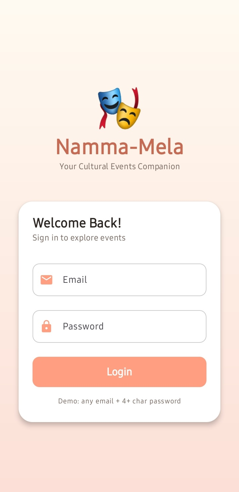
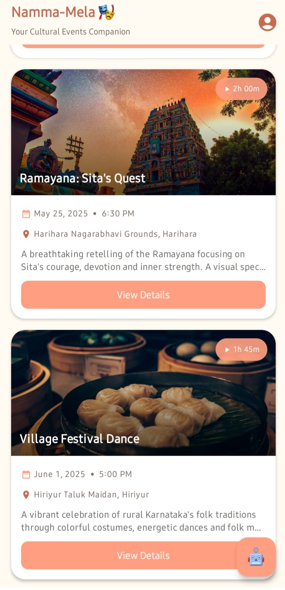
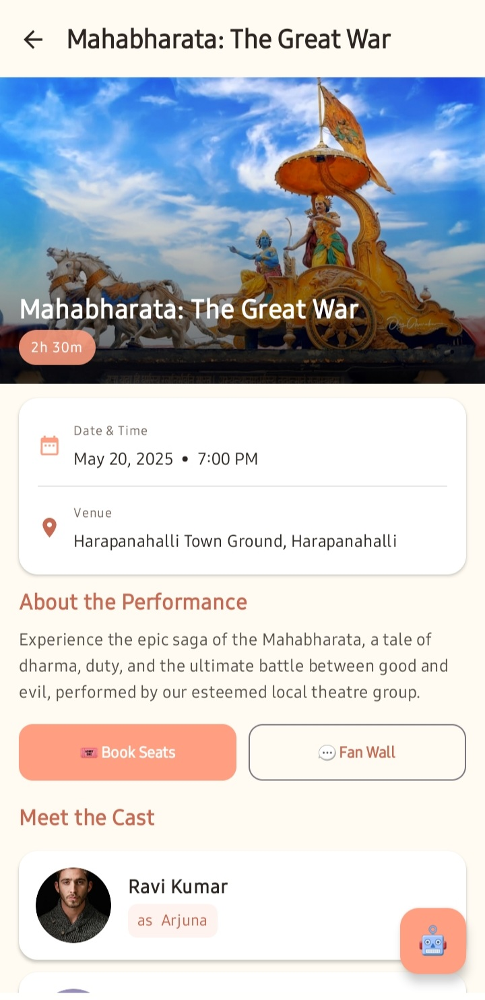
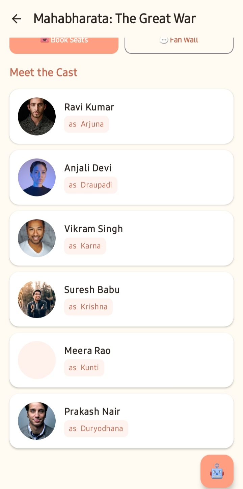
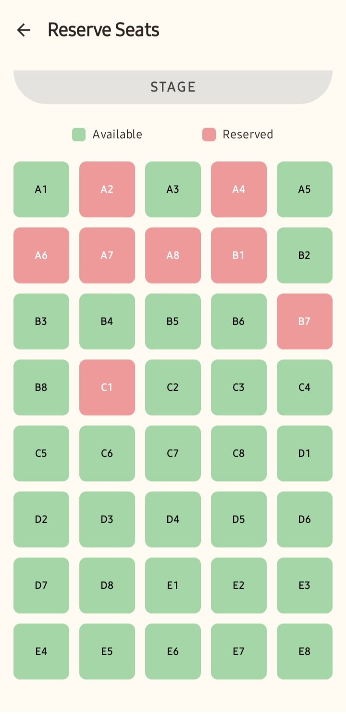
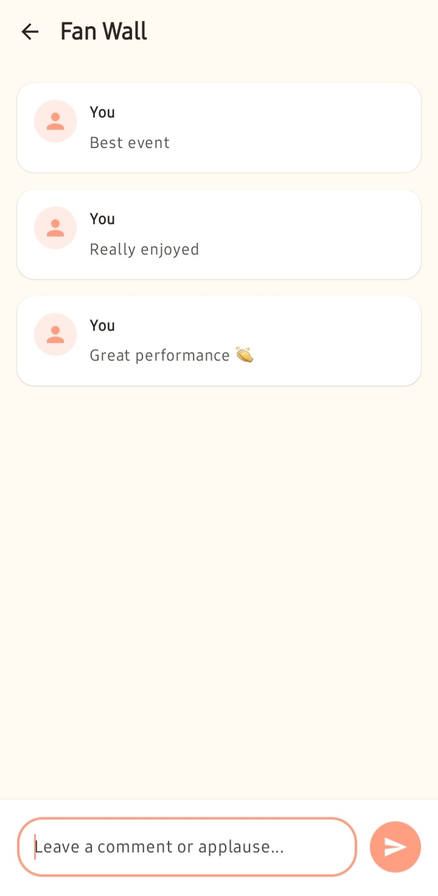
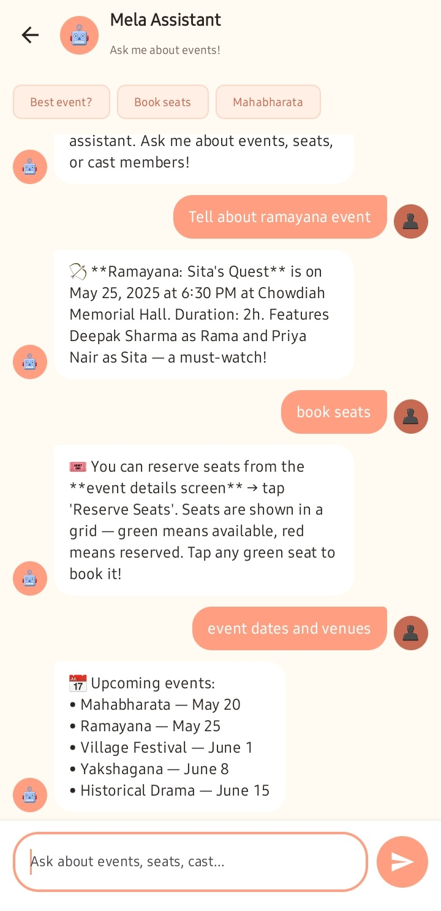

# 🎭 Namma-Mela — Digital Box Office for Rural Theatre

<p align="center">
  
  
  
  
  
</p>

<p align="center">
  <b>Namma-Mela</b> ("Our Festival" in Kannada) is a fully functional Android application that serves as a 
  <b>Digital Box Office for Rural Theatre</b> in Karnataka. It brings traditional performing arts like 
  Yakshagana, Bayalata, and folk theatre into the digital age — making events discoverable, 
  seats bookable, and audiences connected.
</p>

---

## 📱 App Screenshots

| Login Screen | Dashboard | Event Detail |
|:---:|:---:|:---:|
|  |  |  |

| Cast List | Seat Reservation | Fan Wall | Mela Assistant |
|:---:|:---:|:---:|:---:|
|  |  |  |  |

> 

---

## ✨ Features

- 🎭 **Event Discovery Dashboard** — Browse all upcoming rural theatre events with poster images, dates, venues, and descriptions
- 📋 **Event Detail Screen** — Full event information with banner image, cast preview, and quick action buttons
- 🎬 **Cast List** — Performer profiles with photos, actor names, and character roles
- 💺 **Seat Reservation** — Interactive visual seat map (40 seats, A1–E8) with real-time booking confirmation
- 💬 **Fan Wall** — Community space for audiences to post comments and reactions about performances
- 🤖 **Mela Assistant (AI Helper)** — Conversational AI chat interface for event discovery, seat booking guidance, and recommendations
- 🔐 **Login Screen** — Branded cultural entry point with credential validation

---

## 🏗️ Tech Stack

| Layer | Technology |
|---|---|
| Language | Kotlin |
| UI Framework | Jetpack Compose + Material 3 |
| Architecture | MVVM (Model-View-ViewModel) |
| Local Database | Room Database (SQLite ORM) |
| Annotation Processing | KSP (Kotlin Symbol Processing) |
| Navigation | Navigation Compose |
| Image Loading | Glide Compose |
| Async Programming | Kotlin Coroutines + StateFlow |
| IDE | Android Studio |

---

## 🗂️ Project Structure

```
com.example.nammamela/
├── data/
│   ├── local/
│   │   ├── AppDatabase.kt        # Room DB singleton + DatabaseCallback
│   │   └── AppDao.kt             # Data Access Object (all queries)
│   ├── model/
│   │   ├── Play.kt               # Event entity
│   │   ├── CastMember.kt         # Cast member entity
│   │   ├── Seat.kt               # Seat entity
│   │   ├── FanComment.kt         # Fan comment entity
│   │   └── ChatMessage.kt        # AI chat UI model
│   └── repository/
│       └── AppRepository.kt      # Single data access point
├── ui/
│   ├── screens/
│   │   ├── LoginScreen.kt
│   │   ├── DashboardScreen.kt
│   │   ├── EventDetailScreen.kt
│   │   ├── CastListScreen.kt
│   │   ├── SeatReservationScreen.kt
│   │   ├── FanWallScreen.kt
│   │   └── AIHelperScreen.kt
│   ├── viewmodel/
│   │   ├── PlayViewModel.kt
│   │   ├── SeatMapViewModel.kt
│   │   ├── FanWallViewModel.kt
│   │   ├── AIHelperViewModel.kt
│   │   └── ViewModelFactory.kt
│   ├── navigation/
│   │   └── AppNavigation.kt      # NavHost + sealed class Screen routes
│   └── theme/
│       ├── Color.kt              # Custom cultural color palette
│       ├── Type.kt               # Typography scale
│       └── Theme.kt              # MaterialTheme wrapper
└── MainActivity.kt
```

---

## 🗄️ Database Schema

| Table | Key Fields | Purpose |
|---|---|---|
| `plays` | id, title, date, time, venue, posterUrl, description, duration | Theatre event information |
| `cast_members` | id, playId (FK), actorName, roleName, imageUrl | Performer details per event |
| `seats` | seatNumber (PK), isReserved | Seat availability (A1–E8, 40 seats) |
| `fan_comments` | id, playId (FK), userName, comment, timestamp | Audience comments per event |

The database is **pre-populated on first launch** via `DatabaseCallback` with 5 plays, 17 cast members, and 40 seats — no backend server required.

---

## 🏛️ Architecture Overview

```
┌─────────────────────────────────────┐
│         UI LAYER (Compose)          │
│  LoginScreen  DashboardScreen  ...  │
│         collectAsState()            │
└──────────────┬──────────────────────┘
               │ StateFlow / events
┌──────────────▼──────────────────────┐
│       VIEWMODEL LAYER               │
│  PlayViewModel  SeatMapViewModel    │
│  FanWallViewModel  AIHelperViewModel│
└──────────────┬──────────────────────┘
               │ suspend / Flow
┌──────────────▼──────────────────────┐
│         DATA LAYER                  │
│  AppRepository → AppDao             │
│  AppDatabase (Room / SQLite)        │
│  Entities: Play, Seat, Cast, Fan    │
└─────────────────────────────────────┘
```

---

## 🚀 Getting Started

### Prerequisites
- Android Studio (Hedgehog or later)
- Android SDK 26+
- Kotlin 2.0+

### Run the App
1. Clone this repository:
   ```bash
   git clone https://github.com/Apoorva-hu/NammaMela.git
   ```
2. Open the project in **Android Studio**
3. Let Gradle sync complete
4. Run on an emulator or physical device (API 26+)

> **Login credentials (demo):** Any email + any password with 4+ characters

---

## 🎨 Color Palette

| Token | Hex | Usage |
|---|---|---|
| CreamWhite | `#FFF8F0` | Screen backgrounds |
| PeachPrimary | `#E8845A` | Buttons, FAB, accents |
| PeachDark | `#C4623A` | App bar title, icons |
| TextDark | `#2D2D2D` | Primary body text |
| TextLight | `#7A6E66` | Secondary / captions |
| SeatAvailableGreen | `#4CAF50` | Available seats |
| SeatReservedRed | `#F44336` | Reserved seats |

---

## 🔮 Future Enhancements

- [ ] Firebase Firestore for real-time cloud sync
- [ ] Firebase Authentication for secure user accounts
- [ ] Razorpay / Google Pay payment gateway
- [ ] QR code ticket generation on seat reservation
- [ ] Firebase Cloud Messaging push notifications
- [ ] User booking history screen
- [ ] Live AI integration (Google Gemini API)
- [ ] Admin dashboard for theatre organizers
- [ ] Kannada language support

---

## 📚 What I Learned

This project was built during a 3-month internship at **MindMatrix Technologies** as part of the *Android App Development using Gen AI* programme. Key learnings include:

- Declarative UI development with **Jetpack Compose**
- Reactive data pipelines: **Room → Flow → StateFlow → Compose**
- Clean **MVVM architecture** with Repository pattern
- **Kotlin Coroutines** for structured concurrency
- **Navigation Compose** with type-safe routes and argument passing
- Designing a conversational **AI chat interface**
- Systematic **debugging methodology** for Android apps

---

## 👩‍💻 Developer

**Apoorva Patil**
- Department of Computer Science and Engineering
- Dayananda Sagar Academy of Technology and Management (DSATM), Bengaluru
- VTU — 8th Semester, 2025–2026

---

## 📄 License

This project is developed for academic internship purposes.  
© 2025 Apoorva Patil — DSATM, Bengaluru

---

<p align="center">Made with ❤️ for Karnataka's rural theatre community</p>
